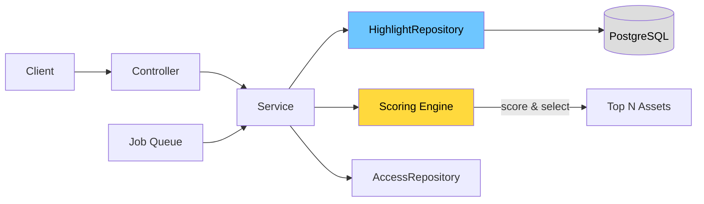
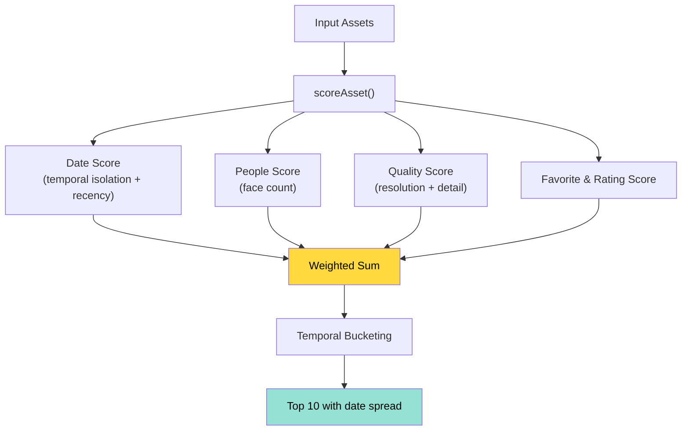

# Highlights Backend — Design Doc

## Overview

This commit adds the full server-side implementation for highlights: a scoring engine that ranks photos, a service layer with CRUD + generation logic, a repository for database queries, a REST controller with 9 endpoints, and all necessary wiring (access control, permissions, jobs, test infrastructure).

---

## Request Flow

---

## Scoring Pipeline

**Default weights:** date 0.2, people 0.25, quality 0.15, favorite+rating 0.4

---

## API Endpoints

| Method   | Path                     | Purpose                                        |
| -------- | ------------------------ | ---------------------------------------------- |
| `GET`    | `/highlights`            | List user's highlights (filterable, paginated) |
| `POST`   | `/highlights`            | Create manual or auto highlight                |
| `POST`   | `/highlights/generate`   | Generate from a tag                            |
| `POST`   | `/highlights/from-album` | Generate from an album                         |
| `GET`    | `/highlights/:id`        | Get a single highlight                         |
| `PUT`    | `/highlights/:id`        | Update name/pin/thumbnail                      |
| `DELETE` | `/highlights/:id`        | Delete a highlight                             |
| `POST`   | `/highlights/:id/assets` | Add assets                                     |
| `DELETE` | `/highlights/:id/assets` | Remove assets                                  |

All endpoints are tagged **beta v2.6.0**.

---

## Files in This Commit

### New Files

| File                                              | Description                                                                                |
| ------------------------------------------------- | ------------------------------------------------------------------------------------------ |
| `server/src/utils/scoring.ts`                     | Scoring engine — `scoreAsset()` and `selectTopAssets()` with temporal bucketing.           |
| `server/src/utils/scoring.spec.ts`                | Tests for scoring: favorites boost, face scoring, resolution, temporal spread, edge cases. |
| `server/src/dtos/highlight.dto.ts`                | DTOs for create, update, search, generate, generate-from-album, and response mapping.      |
| `server/src/repositories/highlight.repository.ts` | Database queries: search, CRUD, asset management, tag/album asset fetching, score updates. |
| `server/src/services/highlight.service.ts`        | Business logic: CRUD, generation from tag/album, background job handler, access checks.    |
| `server/src/services/highlight.service.spec.ts`   | Unit tests for the service: search, get, create, update, delete, generate, regenerate.     |
| `server/src/controllers/highlight.controller.ts`  | REST controller with 9 endpoints, permission guards, and OpenAPI metadata.                 |
| `server/test/factories/highlight.factory.ts`      | Test factory for building highlight fixtures with assets.                                  |

### Modified Files

| File                                                 | What Changed                                                                   |
| ---------------------------------------------------- | ------------------------------------------------------------------------------ |
| `server/src/controllers/index.ts`                    | Registered `HighlightController`.                                              |
| `server/src/repositories/index.ts`                   | Registered `HighlightRepository`.                                              |
| `server/src/services/index.ts`                       | Registered `HighlightService`.                                                 |
| `server/src/services/base.service.ts`                | Added `HighlightRepository` to base service dependencies.                      |
| `server/src/repositories/access.repository.ts`       | Added `HighlightAccess` class with `checkOwnerAccess`.                         |
| `server/src/utils/access.ts`                         | Wired `Permission.HighlightRead/Update/Delete` to owner access checks.         |
| `server/src/services/job.service.ts`                 | Added `ManualJobName.HighlightGenerate` → `JobName.HighlightGenerate` mapping. |
| `server/test/factories/types.ts`                     | Added `HighlightLike` type alias.                                              |
| `server/test/mappers.ts`                             | Added `getForHighlight` dehydration mapper.                                    |
| `server/test/repositories/access.repository.mock.ts` | Added `highlight.checkOwnerAccess` mock.                                       |
| `server/test/utils.ts`                               | Wired `HighlightRepository` mock into `newTestService`.                        |
