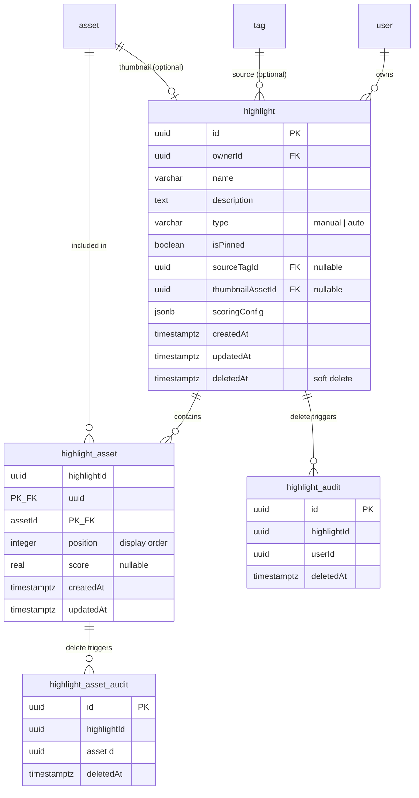
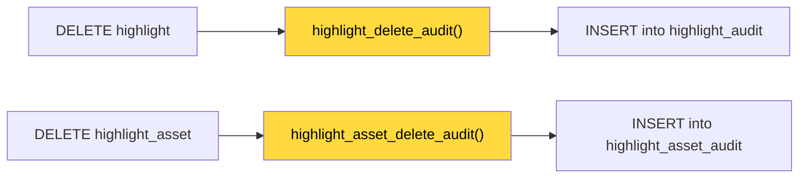
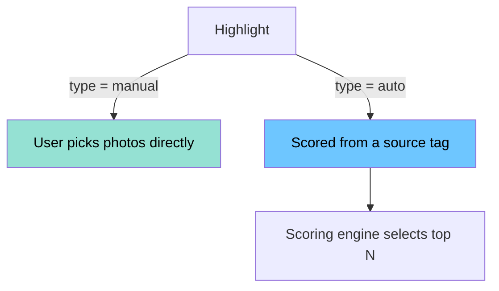

# Highlights Data Model — Design Doc

## Overview

A **highlight** is a curated collection of best photos, either manually picked or auto-generated from a tag using a scoring algorithm. This commit adds the database tables, enums, types, and migration needed to support highlights.

---

## Entity Relationship

---

## Audit Trigger Flow

When a highlight or its assets are deleted, audit triggers automatically log the deletion for sync clients.

---

## Highlight Types

---

## Files in This Commit

### New Files

| File | Description |
|------|-------------|
| `server/src/schema/tables/highlight.table.ts` | Main highlight table — stores name, type, owner, optional source tag, and thumbnail reference. |
| `server/src/schema/tables/highlight-asset.table.ts` | Junction table linking highlights to assets, with position (ordering) and score columns. |
| `server/src/schema/tables/highlight-audit.table.ts` | Audit log for deleted highlights, populated by a trigger. |
| `server/src/schema/tables/highlight-asset-audit.table.ts` | Audit log for deleted highlight-asset links, populated by a trigger. |
| `server/src/schema/migrations/1774119968576-AddHighlightTables.ts` | SQL migration that creates all 4 tables, constraints, indexes, and audit triggers. |

### Modified Files

| File | What Changed |
|------|-------------|
| `server/src/schema/functions.ts` | Added `highlight_delete_audit` and `highlight_asset_delete_audit` trigger functions. |
| `server/src/schema/index.ts` | Registered the 4 new tables and 2 new functions in the schema. |
| `server/src/enum.ts` | Added `HighlightType` enum (`Manual`, `Auto`), `Permission.Highlight*` entries, `ManualJobName.HighlightGenerate`, `JobName.HighlightGenerate`, and `ApiTag.Highlights`. |
| `server/src/database.ts` | Added the `Highlight` TypeScript type used by repositories and services. |
| `server/src/constants.ts` | Added the `ApiTag.Highlights` endpoint description string. |
| `server/src/types.ts` | Added `JobName.HighlightGenerate` to the `JobItem` union type. |
