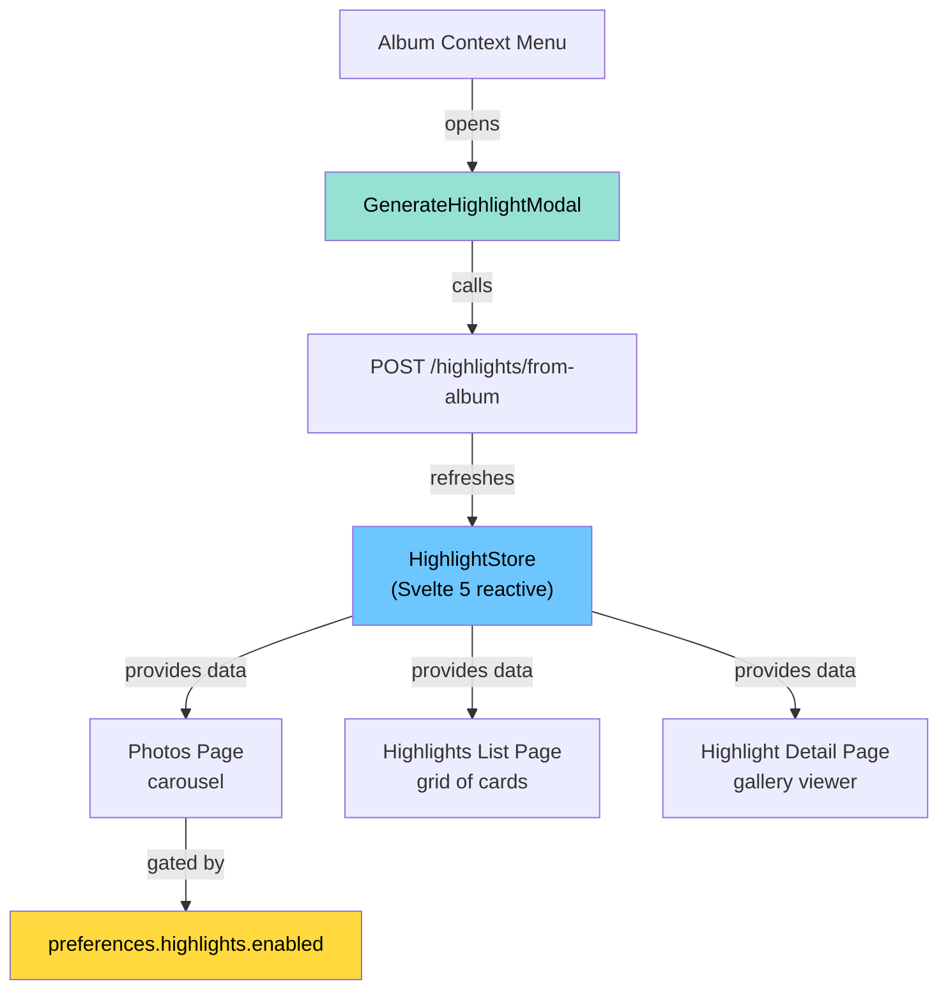
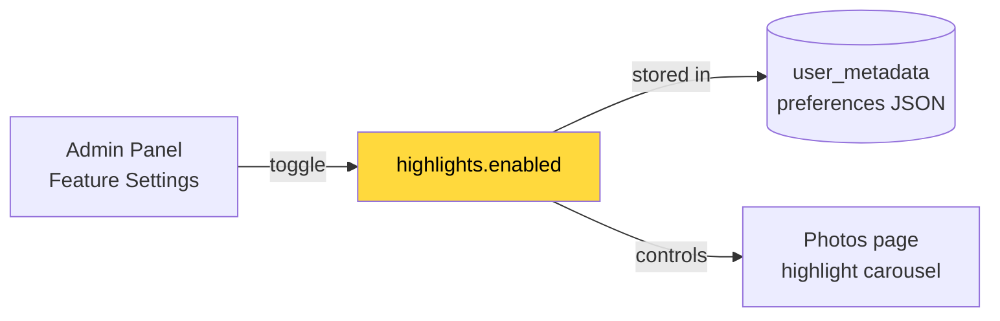

# Highlights Web Frontend & Preferences — Design Doc

## Overview

This commit adds the web frontend for highlights (store, pages, modal, carousel integration) and the user preference toggle that controls visibility. It also wires the album context menu to generate highlights from albums.

---

## Frontend Architecture

---

## User Preference Flow

Default: **enabled = true**

---

## Pages & Routes

| Route | Component | Purpose |
|-------|-----------|---------|
| `/photos` | Existing page | Shows highlight carousel below memories (if enabled) |
| `/highlights` | List page | Grid of all user's highlights with thumbnails, pin badges, photo counts |
| `/highlights/:id` | Detail page | Gallery viewer with pin/delete actions, back navigation |

---

## Files in This Commit

### New Files

| File | Description |
|------|-------------|
| `web/src/lib/stores/highlight.store.svelte.ts` | Svelte 5 reactive store — loads highlights on auth, provides delete/pin operations. |
| `web/src/routes/(user)/highlights/+page.svelte` | Highlights list page — card grid with thumbnails, pin icons, photo counts. |
| `web/src/routes/(user)/highlights/+page.ts` | Page loader — authenticates and fetches highlights. |
| `web/src/routes/(user)/highlights/[id]/[[photos=photos]]/[[assetId=id]]/+page.svelte` | Highlight detail page — gallery viewer with pin/delete actions. |
| `web/src/routes/(user)/highlights/[id]/[[photos=photos]]/[[assetId=id]]/+page.ts` | Detail page loader — fetches single highlight by ID. |
| `web/src/lib/modals/GenerateHighlightModal.svelte` | Modal for naming a highlight when generating from an album. |

### Modified Files

| File | What Changed |
|------|-------------|
| `web/src/lib/route.ts` | Added `Route.highlights()` and `Route.viewHighlight()` helpers. |
| `web/src/routes/(user)/photos/[[assetId=id]]/+page.svelte` | Added highlight carousel (gated by `preferences.highlights.enabled`). |
| `web/src/lib/components/album-page/albums-list.svelte` | Added "Generate highlight" context menu item for albums with ≥10 assets. |
| `web/src/routes/admin/users/[id]/+layout.svelte` | Added highlights toggle to admin feature settings panel. |
| `i18n/en.json` | Added `"highlights"` translation key. |
| `server/src/dtos/user-preferences.dto.ts` | Added `HighlightsUpdate` and `HighlightsResponse` DTO classes. |
| `server/src/types.ts` | Added `highlights: { enabled: boolean }` to `UserPreferences` type. |
| `server/src/utils/preferences.ts` | Added `highlights: { enabled: true }` to default preferences. |
