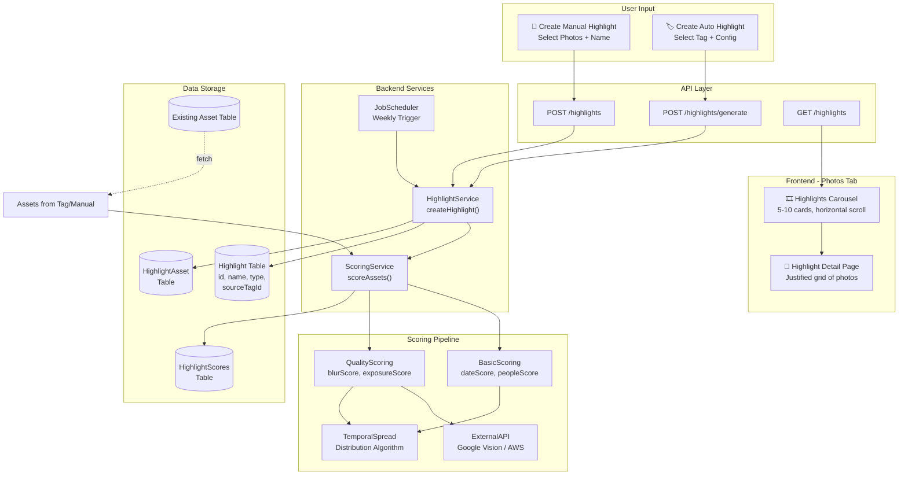
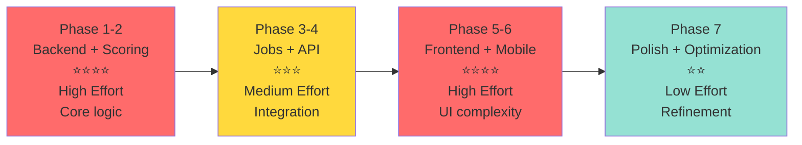

# Plan: Highlights Feature for Immich

**TL;DR:** Build a hybrid highlights system with two modes—**auto-curated** (weekly highlights from selected tags) and **manual** (user-picked photo collections). Score photos using basic metadata (date, people) + optional local/cloud ML scoring (blur, exposure, composition). Store as a new resource similar to Albums+Memories, display in a horizontal carousel below the Immich logo, with pluggable ML scoring for flexibility.

---

## **Architecture & Data Flow**

---

## **Implementation Complexity Scale**

---

## **Steps**

### **Phase 1: Backend Data Model & Infrastructure**

1. **Create Highlight schema tables** (3 new tables)
   - `Highlight` table: id, ownerId, name, description, type (MANUAL|AUTO_CURATED), sourceTagId (nullable, for auto-curated), createdAt, updatedAt, isPinned, thumbnailAssetId
   - `HighlightAsset` table: highlightId, assetId, position (for manual ordering)
   - `HighlightScores` table: assetId, highlightSourceId, score, scoreBreakdown (JSON: {dateScore, peopleScore, qualityScore, aestheticScore})

2. **Create Highlight DTOs & Enums**
   - HighlightCreateDto (name, description, type)
   - HighlightUpdateDto (name, isPinned)
   - HighlightAssetCreateDto (assetIds, sourceTagId for auto-curate)
   - HighlightType enum (MANUAL, AUTO_CURATED)

3. **Add Highlight service** (core business logic)
   - `createHighlight()` - Create manual/auto highlight
   - `generateAutoHighlights()` - Weekly job: find all auto tags, score & curate
   - `scoreAssets()` - Main scoring pipeline coordinator
   - `calculateTemporalSpread()` - Distribution algorithm for curation
   - `upsertHighlightAssets()` - Bulk add/remove assets from highlight

4. **Add Highlight repository**
   - Custom queries: `getHighlightsForUser()`, `getHighlightAssets()`, `findBySourceTag()`
   - Scoring queries with complex WHERE/GROUP BY for temporal windows

---

### **Phase 2: Scoring Engine (Local + Pluggable ML)**

5. **Create scoring module** in `server/src/services/scoring/`
   - `scoring.service.ts` - Orchestrator for all scoring factors
   - `basic-scoring.ts` - Offline-only: dateScore (recency weighted), peopleScore (face count via existing data)
   - `quality-scoring.ts` - Interface for external scorers (blur detection, exposure, composition)
6. **Implement lightweight quality scoring options** (user selectable)
   - **Option A (Local/Offline)**: Simple heuristic scoring
     - Blur detection: Use file-size-to-dimension ratio + basic sharpness metric
     - Exposure: Use histogram data if available in EXIF
     - Composition: Rule-of-thirds via face position or content distribution
   - **Option B (External API)**: Pluggable cloud scorer
     - Interface for Google Vision API, AWS Rekognition, custom ML endpoints
     - Config: allow users to set API key + enable/disable quality scoring

7. **Add scoring configuration** to user preferences
   - Enable/disable each scoring factor
   - Weight customization per user
   - External API selection (Google Vision/AWS/none)

---

### **Phase 3: Scheduled Job Runner**

8. **Implement weekly highlight auto-generation**
   - Add to existing job queue/scheduler in Immich (if exists, otherwise minimal cron)
   - Trigger: Every Sunday at UTC midnight (configurable)
   - Process: For each user's auto-curated highlight rule:
     - Fetch all assets with source tag
     - Score all assets
     - Apply temporal spread algorithm (5-10 best photos spread across time period)
     - Create/update Highlight with selected assets

---

### **Phase 4: REST API Controllers**

9. **Create HighlightController** with endpoints:
   - `POST /highlights` - Create manual highlight
   - `GET /highlights` - List user's highlights (paginated)
   - `GET /highlights/:id` - Get highlight details + assets
   - `PATCH /highlights/:id` - Update name/pin
   - `DELETE /highlights/:id` - Delete highlight
   - `POST /highlights/:id/assets` - Bulk add/remove assets
   - `POST /highlights/generate` - Manually trigger generation from tag
   - `GET /highlights/:id/stats` - Return highlight metadata (creation date, last updated, source tag)

10. **Add permissions**
    - Create `Permission.HighlightRead`, `.HighlightCreate`, `.HighlightUpdate`, `.HighlightDelete`
    - Default: All authenticated users have all permissions (like albums)

---

### **Phase 5: Web Frontend (SvelteKit)**

11. **Create Highlights carousel component** (`carousel-highlights.svelte`)
    - Display 5-10 highlight cards in horizontal scroll
    - Each card shows: highlight name, thumbnail (from thumbnailAssetId), photo count
    - Cards are clickable to open full highlight detail view
    - Add button to create new highlight

12. **Create Highlights detail page** (`/routes/(user)/highlights/[[id=id]]/+page.svelte`)
    - Full-screen view of highlight
    - Show all 5-10 photos in justified grid (like photos tab)
    - Sidebar showing:
      - Highlight name & description
      - Type badge (MANUAL | AUTO_CURATED)
      - Source tag (if auto-curated)
      - Creation date, last updated
      - Photo count
    - Actions: Edit, Pin, Delete, Regenerate (for auto-curated)

13. **Create Highlights management modal** (for creating/editing)
    - **Manual mode**: Name + description + photo picker (multi-select from all photos)
    - **Auto-curate mode**: Name + select source tag + optional scoring config
    - Form validation using DTOs

14. **Integrate carousel into photos page layout**
    - Add carousel to [web/src/routes/(user)/photos/+page.svelte](<web/src/routes/(user)/photos/+page.svelte>) below header
    - Lazy load highlights via API (`GET /highlights`)
    - Show only if user has highlights (hide if empty)

---

### **Phase 6: Mobile (Flutter)**

15. **Create Highlights page** (skeleton for MVP)
    - List highlights in grid/list
    - Open detail view to show curated photos
    - Note: Carousel interaction on mobile UI can be simplified (vertical list vs horizontal scroll)

---

### **Phase 7: Integration & Polish**

16. **Add UI controls**
    - Settings page: Enable/disable highlight feature, configure scoring weights
    - Photos tab: Empty state ("Create your first highlight")
    - Notification (optional): Alert when auto-highlights generated

17. **Database migration scripts**
    - Create all 3 new tables with proper indexes (on ownerId, sourceTagId, createdAt)
    - Backfill default settings

---

## **Relevant Files**

- [server/src/schema/tables/asset.table.ts](server/src/schema/tables/asset.table.ts) — Understanding asset structure & existing metadata
- [server/src/services/album.service.ts](server/src/services/album.service.ts) — Model for collection logic
- [server/src/services/memory.service.ts](server/src/services/memory.service.ts) — Model for temporal/scoring patterns
- [server/src/services/tag.service.ts](server/src/services/tag.service.ts) — Tag system to integrate with
- [server/src/utils/tag.ts](server/src/utils/tag.ts) — Tag utility functions
- [web/src/routes/(user)/photos/+page.svelte](<web/src/routes/(user)/photos/+page.svelte>) — Where carousel will live
- [web/src/routes/(user)/albums/+page.svelte](<web/src/routes/(user)/albums/+page.svelte>) — UI pattern to follow for highlights detail page
- [web/src/lib/managers/timeline-manager/](web/src/lib/managers/timeline-manager/) — Photo grid/carousel patterns

---

## **Verification**

1. **Database**: Connect to Highlight tables, verify schema migration succeeds
2. **API**: Test all 9 endpoints with valid/invalid requests (no auth, foreign keys, cascading deletes)
3. **Scoring**: Run scoring job on sample tag with 50+ photos; verify temporal spread (photos spread across full date range)
4. **UI**:
   - Carousel renders on photos page, scrolls horizontally
   - Create manual highlight → photos appear in detail view
   - Create auto-curated highlight from tag → verify weekly job generates highlights
5. **Performance**: Query /highlights on user with 100+ highlights; should respond <500ms
6. **Edge cases**: Test with empty highlights, empty tags, tags with <5 photos

---

## **Decisions & Trade-offs**

- **Why not just Albums?** Highlights are curated by algorithm + temporal awareness, albums are user-explicit. Separate tables clarify intent and allow different sorting/display logic.
- **Why tables for scores?** Storing scores separately allows re-scoring without regenerating highlights, enables future "best of" ranking across highlights.
- **Why optional cloud ML?** Self-hosted keeps it private; optional cloud allows users who want higher accuracy to opt in without requiring setup.
- **Temporal spread vs pure top-N?** Spreading prevents highlights skewing toward recent days; more visually interesting mix across time period.

---

## **User Requirements Summary**

- **Generation**: ML/AI-driven, both auto-triggered (weekly) and manual
- **Scoring factors**: Basic (date, people count) + Photo quality (blur, exposure, composition)
- **ML approach**: Self-hosted lightweight with pluggable external APIs
- **Highlight types**: Dynamic (auto-curated from tags) + Static (manual selection)
- **UI**: Horizontal carousel below Immich logo on photos tab
- **Photos per highlight**: 5-10 (balanced curation)
- **Curation logic**: Temporal spread with score-based selection
- **Online/Offline**: Support both (optional cloud services)

---

## **Further Considerations**

1. **Implementation sequence**: Start with Phase 1-4 (backend) before touching UI. Test scoring alone first.
2. **ML complexity vs payoff**: Basic scoring (date + people) is 80% of value with 20% effort. Quality scoring adds complexity—consider MVP without it, then phase in.
3. **Auto-generation scheduling**: Immich may have existing job queue (check `server/src/jobs/` or similar). If not, minimal cron is acceptable for weekly tasks.
