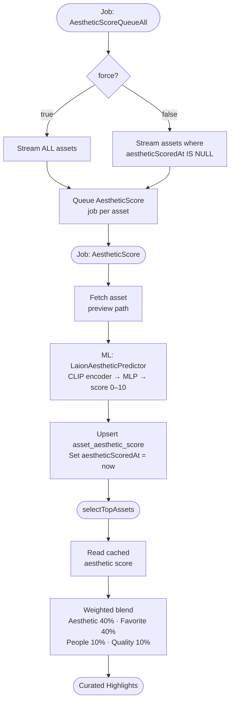

# Aesthetic Scoring Pipeline

```mermaid
flowchart TD
    A([Job: AestheticScoreQueueAll]) --> B{force?}
    B -- true --> D[Stream ALL assets]
    B -- false --> D2[Stream assets where<br>aestheticScoredAt IS NULL]
    D --> E[Queue AestheticScore<br>job per asset]
    D2 --> E

    E --> F([Job: AestheticScore])
    F --> G[Fetch asset<br>preview path]
    G --> H[ML: LaionAestheticPredictor<br>CLIP encoder → MLP → score 0–10]
    H --> I[Upsert asset_aesthetic_score<br>Set aestheticScoredAt = now]

    I --> J([selectTopAssets])
    J --> K[Read cached<br>aesthetic score]
    K --> L[Weighted blend<br>Aesthetic 40% · Favorite 40%<br>People 10% · Quality 10%]
    L --> M([Curated Highlights])
```
