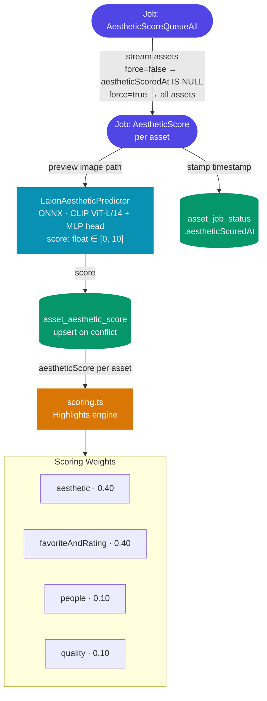

# LAION Aesthetic Scoring — Implementation Tracker

Adds a pluggable per-image aesthetic scoring pipeline to Immich using the LAION Aesthetic Predictor model.
Scores are cached in a dedicated table and fed into the Highlights curation engine.

---

## Architecture Summary

**Force behavior:** `force=false` only streams assets where `aestheticScoredAt IS NULL`.
`force=true` streams all assets; the upsert naturally overwrites the existing score.

---

## Phase 1 — Python ML Service ✅

Goal: Add the LAION Aesthetic Predictor as a pluggable model in the Python ML microservice.

| Step | File                                                                                                          | Status  |
| ---- | ------------------------------------------------------------------------------------------------------------- | ------- |
| 1.1  | `machine-learning/immich_ml/schemas.py` — add `ModelTask.AESTHETIC`, `ModelType.SCORING`, `ModelSource.LAION` | ✅ Done |
| 1.2  | `machine-learning/immich_ml/models/aesthetic/__init__.py` — package marker                                    | ✅ Done |
| 1.3  | `machine-learning/immich_ml/models/aesthetic/predictor.py` — `LaionAestheticPredictor` class                  | ✅ Done |
| 1.4  | `machine-learning/immich_ml/models/__init__.py` — register model in `get_model_class()`                       | ✅ Done |

**Key details:**

- ONNX CLIP ViT-L/14 visual encoder + small MLP head
- Input: PIL Image or bytes → preprocessed to `(1, 3, 224, 224)` NCHW float32
- Output: single float clamped to `[0, 10]`
- CLIP normalization: mean `[0.48145466, 0.4578275, 0.40821073]`, std `[0.26862954, 0.26130258, 0.27577711]`

---

## Phase 2 — Database Schema ✅

Goal: New table for cached scores and a sentinel timestamp column on job status.

| Step | File                                                                                              | Status  |
| ---- | ------------------------------------------------------------------------------------------------- | ------- |
| 2.1  | `server/src/schema/tables/asset-aesthetic-score.table.ts` — new table `asset_aesthetic_score`     | ✅ Done |
| 2.2  | `server/src/schema/tables/asset-job-status.table.ts` — add `aestheticScoredAt: Timestamp \| null` | ✅ Done |
| 2.3  | `server/src/schema/index.ts` — import table, add to `tables[]` and `DB` interface                 | ✅ Done |

**Design rationale:** Separate table (not a column on `asset` or `exif`) mirrors the `smart_search` pattern,
making it safe to drop and repopulate when switching models.

---

## Phase 3 — Server Enums, Config, DTO, ML Repo ✅

Goal: Wire up queue/job names, system config, DTO, and ML repository method.

| Step | File                                                                                                             | Status  |
| ---- | ---------------------------------------------------------------------------------------------------------------- | ------- |
| 3.1  | `server/src/enum.ts` — `QueueName.AestheticScore`, `JobName.AestheticScoreQueueAll`, `JobName.AestheticScore`    | ✅ Done |
| 3.2  | `server/src/config.ts` — `machineLearning.aesthetic: { enabled, modelName }`                                     | ✅ Done |
| 3.3  | `server/src/dtos/model-config.dto.ts` — `AestheticConfig extends ModelConfig`                                    | ✅ Done |
| 3.4  | `server/src/repositories/machine-learning.repository.ts` — `scoreAesthetic()`, `AestheticRequest/Response` types | ✅ Done |

---

## Phase 4 — Asset Job Repository + Type System ✅

Goal: Stream queries for the job pipeline and type-safe job item union entries.

| Step | File                                                                                                               | Status  |
| ---- | ------------------------------------------------------------------------------------------------------------------ | ------- |
| 4.1  | `server/src/repositories/asset-job.repository.ts` — `streamForAestheticScore(force?)`, `getForAestheticScore(id)`  | ✅ Done |
| 4.2  | `server/src/types.ts` — add `AestheticScoreQueueAll` and `AestheticScore` to `JobItem` union                       | ✅ Done |
| 4.3  | `server/src/repositories/asset.repository.ts` — `aestheticScoredAt` in `upsertJobStatus`, `upsertAestheticScore()` | ✅ Done |

---

## Phase 5 — Service Layer ✅

Goal: NestJS service implementing the two job handlers.

| Step | File                                                                                                   | Status  |
| ---- | ------------------------------------------------------------------------------------------------------ | ------- |
| 5.1  | `server/src/services/aesthetic-score.service.ts` — `handleQueueAestheticScore`, `handleAestheticScore` | ✅ Done |
| 5.2  | `server/src/services/index.ts` — import and register `AestheticScoreService`                           | ✅ Done |

---

## Phase 6 — Scoring Integration ✅

Goal: Fold the pre-computed aesthetic score into the Highlights scoring engine.

| Step | File                                                                                                                                                   | Status  |
| ---- | ------------------------------------------------------------------------------------------------------------------------------------------------------ | ------- |
| 6.1  | `server/src/utils/scoring.ts` — `aestheticScore?` on `ScoringAsset`, `aestheticWeight` in config, `calculateAestheticScore()`, blend in `scoreAsset()` | ✅ Done |

**Weight rebalance (must sum to 1.0):**
| Factor | Old | New |
|--------|-----|-----|
| **aesthetic** | — | **0.40** |
| favoriteAndRating | 0.40 | 0.40 |
| people | 0.25 | 0.10 |
| quality | 0.15 | 0.10 |
| date | 0.20 | 0 |

---

## Changelog

| Date      | Change                                                                        |
| --------- | ----------------------------------------------------------------------------- |
| Session 1 | Phases 1–3 completed (ML service, DB schema, server enums/config/DTO/ML repo) |
| Session 2 | Phases 4–6 completed (job streams, type system, service, scoring integration) |
