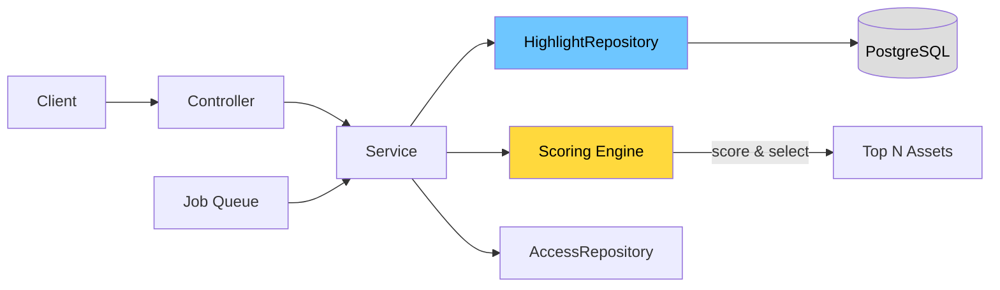
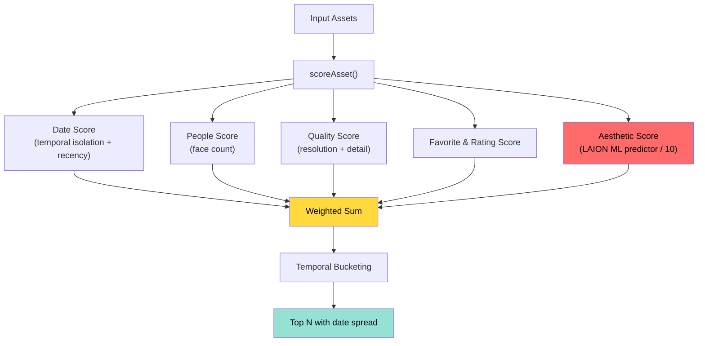
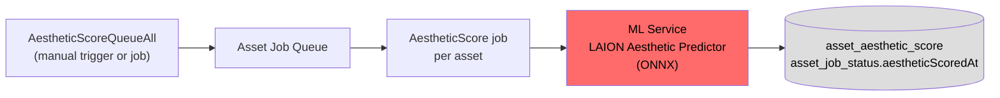

# Highlights Backend — Design Doc

## Overview

The backend for highlights consists of a scoring engine that ranks photos, a service layer with CRUD + generation logic, a repository for database queries, a REST controller with 9 endpoints, and an aesthetic scoring pipeline backed by the LAION Aesthetic Predictor ML model.

---

## Request Flow

---

## Scoring Pipeline

**Default weights (from `DEFAULT_SCORING_CONFIG`):**

| Factor | Weight | Notes |
|---|---|---|
| Date / temporal isolation | `0` | Disabled by default; applied via temporal bucketing post-scoring |
| People (face count) | `0.1` | 1 face → 0.6, 2 faces → 0.8, 3+ → 1.0 |
| Quality (resolution + detail) | `0.1` | Megapixels + bytes/pixel heuristics |
| Favorite & Rating | `0.4` | Favorited = +1.0, rating /5 normalized |
| Aesthetic (LAION ML) | `0.4` | ML score divided by 10, falls back to 0.5 when unscored |
| Max photos per highlight | `10` | `maxPhotos` in config |

---

## Aesthetic Scoring Pipeline

Aesthetic scores are computed separately by the ML service and stored in `asset_aesthetic_score` before highlight generation runs.

The ML model is configured via `machineLearning.aesthetic` in system config (default model: `aesthetic-predictor-v2-5`).

---

## API Endpoints

| Method | Path | Purpose |
| ------ | ---- | ------- |
| `GET` | `/highlights` | List user's highlights (filterable by type, pinned) |
| `POST` | `/highlights` | Create manual or auto highlight |
| `POST` | `/highlights/generate` | Generate from a tag |
| `POST` | `/highlights/from-album` | Generate from an album |
| `GET` | `/highlights/:id` | Get a single highlight |
| `PUT` | `/highlights/:id` | Update name / pin / thumbnail |
| `DELETE` | `/highlights/:id` | Delete a highlight |
| `POST` | `/highlights/:id/assets` | Add assets to a highlight |
| `DELETE` | `/highlights/:id/assets` | Remove assets from a highlight |

---

## Files

### New Files

| File | Description |
| ---- | ----------- |
| `server/src/utils/scoring.ts` | Scoring engine — `scoreAsset()` and `selectTopAssets()` with temporal bucketing. |
| `server/src/utils/scoring.spec.ts` | Tests: favorites boost, face scoring, resolution, temporal spread, edge cases. |
| `server/src/services/aesthetic-score.service.ts` | Job handlers for `AestheticScoreQueueAll` and `AestheticScore` — calls ML repository, writes to `asset_aesthetic_score`. |
| `server/src/dtos/highlight.dto.ts` | DTOs for create, update, search, generate, generate-from-album, and response mapping. |
| `server/src/repositories/highlight.repository.ts` | Database queries: search, CRUD, asset management, tag/album asset fetching, score updates. |
| `server/src/services/highlight.service.ts` | Business logic: CRUD, generation from tag/album, background job handler, access checks. |
| `server/src/services/highlight.service.spec.ts` | Unit tests: search, get, create, update, delete, generate, regenerate. |
| `server/src/controllers/highlight.controller.ts` | REST controller with 9 endpoints, permission guards, and OpenAPI metadata. |
| `server/test/factories/highlight.factory.ts` | Test factory for building highlight fixtures with assets. |

### Modified Files

| File | What Changed |
| ---- | ------------ |
| `server/src/controllers/index.ts` | Registered `HighlightController`. |
| `server/src/repositories/index.ts` | Registered `HighlightRepository`. |
| `server/src/services/index.ts` | Registered `HighlightService` and `AestheticScoreService`. |
| `server/src/services/base.service.ts` | Added `HighlightRepository` to base service dependencies. |
| `server/src/repositories/access.repository.ts` | Added `HighlightAccess` class with `checkOwnerAccess`. |
| `server/src/repositories/machine-learning.repository.ts` | Added `scoreAesthetic()` method, `AestheticRequest`/`AestheticResponse` types, and `ModelTask.AESTHETIC` / `ModelType.SCORING` enum values. |
| `server/src/repositories/asset-job.repository.ts` | Added `streamForAestheticScore()` and `getForAestheticScore()`. |
| `server/src/utils/access.ts` | Wired `Permission.HighlightRead/Update/Delete` to owner access checks. |
| `server/src/services/job.service.ts` | Added `ManualJobName.HighlightGenerate` → `JobName.HighlightGenerate` mapping. |
| `server/src/config.ts` | Added `machineLearning.aesthetic`, `memories.enabled`, `highlights.enabled` config with defaults. |
| `server/src/dtos/system-config.dto.ts` | Exposed `aestheticScore` and `highlightGenerate` queue settings and `aesthetic` ML config via API. |
| `server/src/enum.ts` | Added `QueueName.AestheticScore`, `QueueName.HighlightGenerate`, `JobName.AestheticScore`, `JobName.AestheticScoreQueueAll`. |
| `server/test/factories/types.ts` | Added `HighlightLike` type alias. |
| `server/test/mappers.ts` | Added `getForHighlight` dehydration mapper. |
| `server/test/repositories/access.repository.mock.ts` | Added `highlight.checkOwnerAccess` mock. |
| `server/test/utils.ts` | Wired `HighlightRepository` mock into `newTestService`. |

---

## Decisions & Trade-offs

- **Why not just Albums?** Highlights are curated by algorithm + temporal awareness; albums are user-explicit. Separate tables clarify intent and allow different sorting/display logic.
- **Why temporal bucketing?** Spreading photos across the time range prevents highlights skewing toward the most recent burst of activity; more visually interesting mix.
- **Aesthetic weight = 0.4 (equal to favorites/rating):** The LAION predictor is a strong signal when available. It falls back gracefully to a neutral 0.5 for unscored assets so generation works even before ML scoring has run.
- **Date weight = 0 by default:** Temporal spread is enforced via post-scoring bucketing (`selectTopAssets`) rather than a raw weight, which is more effective at distributing across the timeline.
- **Pluggable scoring:** `ScoringConfig` is stored as JSONB per highlight, allowing per-highlight weight overrides without schema changes.
