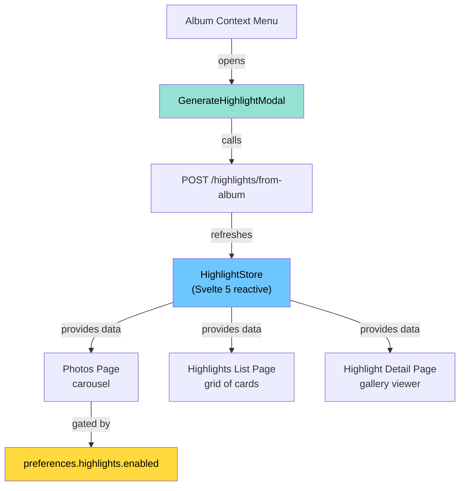
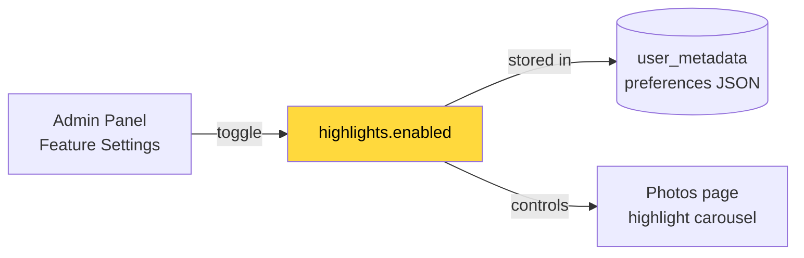

# Highlights Web Frontend & Preferences — Design Doc

## Overview

The web frontend for highlights consists of a Svelte 5 reactive store, list and detail pages, a generate-from-album modal, and a user preference toggle controlling visibility. The album context menu also surfaces highlight generation for albums with enough assets.

---

## Frontend Architecture

---

## User Preference Flow

Default: **enabled = true** (set in both `server/src/utils/preferences.ts` and `server/src/config.ts`).

---

## Pages & Routes

| Route | Component | Purpose |
| ----- | --------- | ------- |
| `/photos` | Existing page | Shows highlight carousel below memories (gated by `preferences.highlights.enabled`) |
| `/highlights` | List page | Grid of all user's highlights — thumbnails, pin badges, photo counts |
| `/highlights/:id` | Detail page | `HighlightViewer` component — gallery with pin/delete/back actions |

---

## Files

### New Files

| File | Description |
| ---- | ----------- |
| `web/src/lib/stores/highlight.store.svelte.ts` | Svelte 5 reactive store — loads highlights on auth, provides delete/pin operations. |
| `web/src/lib/components/highlight-page/highlight-viewer.svelte` | Full-page highlight viewer component used by the detail route. |
| `web/src/routes/(user)/highlights/+page.svelte` | List page — card grid with thumbnails, pin icons, photo counts. |
| `web/src/routes/(user)/highlights/+page.ts` | Page loader — authenticates and fetches highlights via `searchHighlights()`. |
| `web/src/routes/(user)/highlights/[id]/[[photos=photos]]/[[assetId=id]]/+page.svelte` | Detail page — wraps `HighlightViewer`. |
| `web/src/routes/(user)/highlights/[id]/[[photos=photos]]/[[assetId=id]]/+page.ts` | Detail page loader — fetches single highlight by ID. |
| `web/src/lib/modals/GenerateHighlightModal.svelte` | Modal for naming a highlight when generating from an album. |

### Modified Files

| File | What Changed |
| ---- | ------------ |
| `web/src/lib/route.ts` | Added `Route.highlights()` and `Route.viewHighlight({ id })` helpers. |
| `web/src/routes/(user)/photos/[[assetId=id]]/+page.svelte` | Added highlight carousel, gated by `preferences.highlights.enabled`. |
| `web/src/lib/components/album-page/albums-list.svelte` | Added "Generate highlight" context menu item (shown for albums with ≥ 10 assets). |
| `web/src/routes/admin/users/[id]/+layout.svelte` | Added highlights enabled toggle to admin feature settings panel. |
| `i18n/en.json` | Added `"highlights"`, `"generate_highlight"`, `"highlight_created"`, `"unable_to_create_highlight"` keys. |
| `server/src/dtos/user-preferences.dto.ts` | Added `HighlightsUpdate` (PATCH) and `HighlightsResponse` (GET) DTO classes. |
| `server/src/types.ts` | Added `highlights: { enabled: boolean }` to `UserPreferences` type. |
| `server/src/utils/preferences.ts` | Added `highlights: { enabled: true }` to default preferences. |
